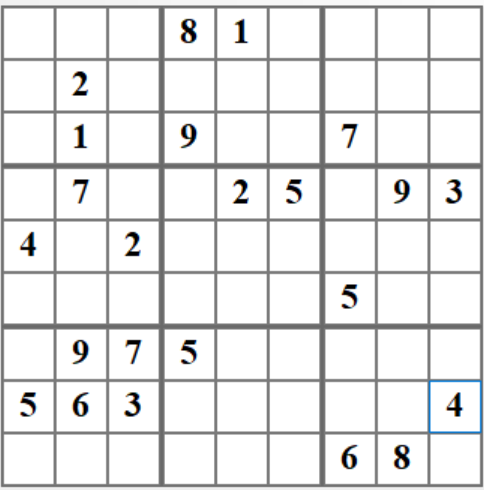
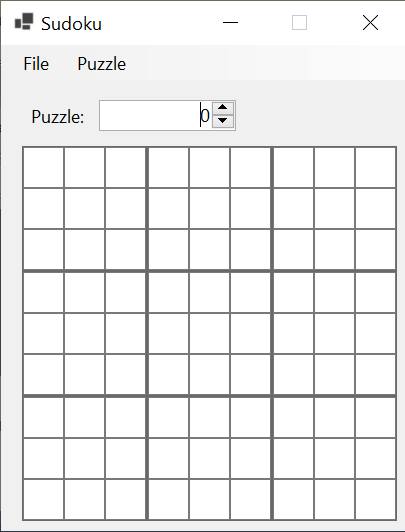

# Homework Assignment 1: Sudoku Solver

For this assignment, you are to write a program that solves Sudoku puzzles.

## 0. Contents

[TOC]

## 1. User Requirements

Sudoku is a type of puzzle that usually consists of a 9x9 grid in which some cells contain values in the range 1-9; for example:

The goal is to fill in the empty cells with values in the range 1-9 such that:

- Each row contains exactly one of each value.
- Each column contains exactly one of each value.
- Each 3x3 block (outlined with heavier lines in the above figure) contains exactly one of each value.

For example, this is a solution for the above puzzle:

We will also consider 4x4 puzzles divided into 4 blocks and using the values 1-4.

Your program must be able to:

- Read a file of Sudoku puzzle descriptions (see [Section 1.1. File Format](#11-file-format) below).
- Allow the user to select a specific or random puzzle from the puzzles read from the file.
- Allow the user attempt to solve the puzzle.
- Check a user's solution.
- Attempt to solve the selected puzzle (ignoring any values supplied by the user), displaying either the solution or a message indicating that no solution was found.

The user interface will be provided to you.

### 1.1. File Format

Each input file must begin with a line containing either "2" or "3", giving the number of rows (or columns) in each block of the puzzle. Thus, "2" indicates a 4x4 puzzle (2 rows and columns in each block), and "3" indicates a 9x9 puzzle (3 rows and columns in each block).

Each line after the first must then be a string whose length is the number of cells in the puzzle. Thus, if the value on the first line is *b*, the number of rows/columns in the puzzle will be *b*2, and the length of each input line (after the first) will be (*b*2)2 = *b*4 (16 for a 4x4 puzzle or 81 for a 9x9 puzzle). This string should contain the values in the puzzle cells, read left-to-right from top to bottom, using '.' to denote an empty cell. For example, the puzzle shown in the first figure above would be encoded by the following line:

`...81.....2........1.9..7...7..25.934.2............5...975.....563.....4......68.`

## 2. Starting the Assignment

Create a GitHub repository using the link provided on the Canvas assignment page. This repository contains part of the code that you will need, including the entire user interface. It also contains a unit test project, **Ksu.Cis300.Sudoku.Tests**, that you can use to test most of your code.

## 3. User Interface

In what follows, we will describe the intended behavior of the finished program. The user interface itself has been provided for you, but you will need to add code to complete its functionality - see [Section 6. Coding Requirements](#6-coding-requirements).

### 3.1. Initial GUI

When the finished program starts, it should display the following GUI, which is the same as the one displayed by the start code provided:

The "File" menu should contain the following menu items:

- Open Puzzle File
- Load Random Puzzle

The "Puzzle" menu should contain the following menu items:

- Solve Puzzle
- Check Solution

The only item in the two menus that should be enabled initially is "Open Puzzle File". It should be impossible to change the value in the **NumericUpDown**. Any value from 1 to 9 may be entered into any of the cells in the puzzle, but all other values should be ignored. 

To reiterate, the provided start code should exhibit all of the above behavior. Most of the functionality described in the remainder of this section will need to be added (see [Section 6. Coding Requirements](#6-coding-requirements)).

### 3.2. The "Open Puzzle File" Menu Item

Selecting this menu item in either the provided start code or the finished program should cause an **OpenFileDialog** to be displayed. If the user closes this dialog without selecting a file, either in the provided start code or the finished program, nothing should change. Selecting a file within the provided start code will cause a **MessageBox** displaying a **NotImplementedException** to be displayed, and nothing should change. Your finished program, however, should attempt to read the selected file.

If the file is successfully read, the following changes should occur within the GUI:

- The "Load Random Puzzle" and "Solve Puzzle" menu items should be enabled.
- The value in the **NumericUpDown** should be set to 0.
- The size of the puzzle should be set to the size indicated by the input file.
- The first puzzle (i.e., puzzle 0) encoded in the input file should be displayed, replacing any values that any puzzle cells may have previously contained. The nonempty cells will be read-only so that their values cannot be changed by the user.

If reading the input file throws an exception, this exception should should be displayed in a **MessageBox** and nothing should change within the GUI. Your code will need to check for the following error conditions:

- If the first line of the file contains an integer less than 2 or greater than 3, it should throw an **IOException** with the following message: "Invalid block size."
- If any line after the first has an incorrect length (see [Section 1.1. File Format](#11-file-format)), it should throw an **IOException** with a message of the form, "Line *n* has the wrong length.", where *n* is the line number of the first invalid line. Note that the line giving the block size is line 1; hence, the line containing the first puzzle description is line 2.
- If any line after the first has a character other than '.' or a valid value for the current puzzle size, it should throw an **IOException** with a message of the form, "Line *n* has an invalid character.", where *n* is the line number of the first invalid line.

### 3.3. The "Load Random Puzzle" Menu Item

Selecting this menu item should cause the following changes to occur within the GUI:

- The **NumericUpDown** should be set to a random nonnegative value less than the number of puzzles in the currently-loaded file.
- The puzzle indicated by the value placed into the **NumericUpDown** should be displayed, replacing any values that any puzzle cells may have previously contained. The nonempty cells will be read-only so that their values cannot be changed by the user. Note that a value of 0 in the **NumericUpDown** refers to the first puzzle in the file, etc.

### 3.4. The "Solve Puzzle" Menu Item

Selecting this menu item should first cause the program to try to find a solution to the puzzle, disregarding any values that may have been entered by the user. If a solution is found, it should be placed into the puzzle, leaving the cells containing initial puzzle values as read-only. If no solution is found, it should display a **MessageBox** containing the message, "The puzzle has no solution", and the GUI should display the original puzzle.

### 3.5. The "Check Solution" Menu Item

This menu item should only be enabled when all the cells in the puzzle are filled. Clicking this menu item should cause the program to determine whether the values in the cells constitute a solution to the puzzle. If so, it should display a **MessageBox** containing the message, "The puzzle is correctly solved." Otherwise, it should display a **MessageBox** containing the message, "The puzzle is NOT solved."

### 3.6. The NumericUpDown

After a puzzle file has been loaded successfully, the range of the **NumericUpDown** should be all nonnegative integers less than the number of puzzles in the file. Selecting one of these values should cause the corresponding puzzle to be loaded, as if this value had been randomly chosen by the "Load Random Puzzle" menu item.

## 4. The Algorithm to Solve Puzzles

Before we discuss any program structure, we need to describe the algorithm to be used to solve the puzzles. This algorithm is an exhaustive search using backtracking. It will proceed through the cells of the puzzle row by row, attempting to fill each empty cell with a valid value. If this is impossible, the algorithm will *backtrack* by undoing the most recent guess and continuing from there, as if the undone guess were an invalid value.

In order to facilitate backtracking, the algorithm will use a stack to store the locations it has filled with values. This stack will *not* include locations containing fixed values provided in the given puzzle; hence, it will initially be empty. Because stack accesses are LIFO, the algorithm will always be able to undo the most recent guess.

Besides the stack, the algorithm uses the following values to keep track of where it is currently working:

- The current row, initially 0.
- The current column, initially 0.
- The current guess, initially the smallest value that can be placed in a puzzle cell (this will always be '1').

The algorithm then iterates as long as the current row is less than the number of rows in the puzzle. On each iteration:

- If the current column is greater than or equal to the number of columns in the puzzle, go to the beginning of the next row by incrementing the current row and setting the current column to 0.
- Otherwise, if the puzzle has a nonempty cell at the current row and column, go to the next column by incrementing the current column. 
- Otherwise, if the current guess is larger than the maximum value that can be placed in a puzzle cell, then backtrack:
  - If the stack is empty, backtracking is impossible; hence, return, indicating that the puzzle has no solution.
  - Otherwise:
    - Remove the top location from the stack, and set the current row and column to this location.
    - Set the current guess to the puzzle value stored in this location.
    - Remove the puzzle value stored in this location.
    - Increment the current guess.
- Otherwise, if the current guess cannot legally be placed in the puzzle at the current row and column, increment the current guess.
- Otherwise, place the current guess into the puzzle at the current row and column, push this location onto the stack, increment the current column, and set the current guess to its minimum value.

If the above loop completes without returning, the puzzle has been solved.

## 5. Software Architecture

The following class diagram shows the software architecture for the program:

The **UserInterface** class implements the GUI. You will not need to modify it or use it in your code. **Utilities** is a **static** class (i.e., all of its members are **static**) provided for you. You will not need to modify this class, but you will need to use some of its members, which are explained below. You will need to add both the **Location** and the **PotentialConflicts** classes and implement them in their entirety. **Location** is an immutable class whose instances represent locations within the puzzle. **PotentialConflicts** is a class whose instances represent potential conflicts within a puzzle being solved. You will need to use this class to help you determine whether individual guesses are valid. **SudokuSolver** is a **static** class that contains the code for reading puzzle files and solving puzzles. A skeleton of this class has been provided, but you will need to fill in most of its code.

Details of the code you must provide are given in [Section 6. Coding Requirements](#6-coding-requirements). The **Utilites** class contains the following **public static** members available for your use:

- A **readonly int** `MinBlockSize` giving the minimum number of rows/columns in a single block within a puzzle.
- A **readonly int** `MaxBlockSize` giving the maximum number of rows/columns in a single block within a puzzle.
- A **readonly char** `MinNumber` giving the minimum value that can be placed within a cell in a puzzle.
- A method **GetBlock** that takes as its parameters three **int**s giving a row of the puzzle, a column of the puzzle, and the number of row/columns within each block, and returns an **int** identifying the block in which the given location occurs. The values identifying blocks start at 0 for the block in the upper left corner, and increase first from left to right, then from top to bottom. Hence, the second block on the first row is block 1, etc.

## 6. Coding Requirements

In this section, we give the coding requirements for each of the classes that you will need to provide or modify in the above class diagram. You do not need to use the names for **private** members shown in the diagram as long as you follow the [naming conventions](https://cis300.cs.ksu.edu/appendix/style/naming/); however, you must use all of the names shown for **public** members, as failing to do so might introduce syntax errors in the provided start code. As you write your code, avoid using specific literal values like 2 or '1'. Instead, use constants defined either in the **Utilities** class or in classes that you write. Also, don't use the **Math.Pow** method to raise a value to an integer power. Instead, multiply the integer by itself the appropriate number of times.

### 6.1. The Location Class

To add this class:

1. In the Solution Explorer, right-click on the project name (in bold face).
2. Select "Add -\> Class...".
3. Replace the "Name" field at the bottom of the resulting dialog with "Location.cs".
4. In the **class** statement of the resulting file, replace "**internal**" with "**public**".

This class needs the following **public** properties (see ["Properties"](https://cis300.cs.ksu.edu/appendix/syntax/properties/index.html), each implemented using the default implementation:

- A **Row** property that gets an **int** giving the row of the location. It should not have a **set** accessor.
- A **Column** property that gets an **int** giving the column of the location. It should not have a **set** accessor.

This class also needs a **public** constructor that takes two **int** parameters and uses them to initialize the above properties.

### 6.2. The PotentialConflicts Class

You will need to add this class in the same way that you added the **Location** class. This class will need four **private** fields, one **public** property, a **public** constructor, one **private** method, and two **public** methods. These are all described in what follows.

#### 6.2.1. Fields and property

Instances of this class will be used to record potential conflicts - the values already stored in each row, column, and block. To record this information it will use three 2-dimensional arrays of **bool**s - arrays indexed using two indices, separated by a comma. The first index will indicate a row, column, or block number. The second index will be an **int** representing one of the puzzle values as follows: the **char** value `c` will be represented by `c - Utilities.MinNumber`. For example, the puzzle value '2' will be represented by the **int** 1. Note that this **int** representation of puzzle values will only be used internally within this class - elsewhere, puzzle values will be represented by either **char**s ('1', '2', etc.) or **string**s ("1", "2", etc.). Thus, each of these arrays will be *n*x*n*, where *n* is the number of rows/columns in the puzzle.

This class will need the following **private** fields:

- A **bool[&nbsp;,&nbsp;]** such that element [*i*, *k*] indicates whether row *i* contains the puzzle value represented by *k*, as described above.
- A **bool[&nbsp;,&nbsp;]** such that element [*j*, *k*] indicates whether column *j* contains the puzzle value represented by *k*.
- A **bool[&nbsp;,&nbsp;]** such that element [*b*, *k*] indicates whether block *b* contains the puzzle value represented by *k*, where *b* is the value computed by **Utilities.GetBlock**.
- An **int** giving the number of rows/columns within a single block of the puzzle.

It also needs a **public** **HasConflict** property that gets a **bool** indicating whether the puzzle passed to the constructor (see below) contains any conflicts - rows, columns, or blocks that contain more than one occurrence of any value. Use the default implementation with no **set** accessor.

#### 6.2.2. A private static method to convert a char to its int representation

This method should take as its only parameter a **char** giving a puzzle value. It should return an **int** giving the index that should be used to represent this character when indexing into one of the three **bool[&nbsp;,&nbsp;]**s - see the first paragraph of [Section 6.2.1. Fields and property](#621-fields-and-property).

#### 6.2.3. A public SetConflict method 

This method should take the following parameters:

- An **int** giving the row of a puzzle cell.
- An **int** giving the column of a puzzle cell.
- A **char** giving the value to be placed in this cell.
- A **bool** that will be **true** if the potential conflict is to be added or **false** if it is to be removed.

It should return nothing. It needs to store the given **bool** in the appropriate locations of each of the three **bool[&nbsp;,&nbsp;]**s. Use the above method to obtain the second index to use for each of these arrays.

#### 6.2.4. A public CreatesConflict method

This method should take the following parameters:

- An **int** giving the row of a puzzle cell.
- An **int** giving the column of a puzzle cell.
- A **char** giving the value to be placed in this cell.

It should return a **bool** indicating whether placing the given **char** at the given location would create a conflict; i.e., whether the given **char** already occurs within the same row, column, or block. You should be able to determine this by looking up one location in each of the three arrays.

#### 6.2.5. A public constructor

This constructor will need the following parameters:

- A **string[&nbsp;,&nbsp;]** giving the puzzle.
- An **int** giving the number of rows/columns in a single block of the puzzle.

First, make sure the **string[&nbsp;,&nbsp;]** is not **null** - if it is, throw an **ArgumentNullException**. You do *not* need to check that it is the proper size.

You will then need to use the parameters to initialize all four **private** fields and the **public** property. To initialize the arrays, you will first need to compute the number of rows/columns in the puzzle and initialize each array to a new instance of that size. 

To complete the initialization, you will need to iterate through the puzzle. For each nonempty puzzle location, first check to see if the value in that location introduces a conflict (use the appropriate method above). If so, record that the puzzle has a conflict by setting the property to **true**. Then regardless of whether a conflict already exists, use the appropriate method above to record the potential conflicts that the value in this location introduces.

### 6.3. The SudokuSolver Class

Note that this class is **static**. As a result, each field and method also needs to be **static**. A method stub has been provided for each method. In addition, you will need to add a **private** field. We describe each of these members in what follows.

#### 6.3.1. private field

This class needs a **private static readonly char** field to record the character used to represent an empty cell within a line of an input file. This character should be `'.'`.

#### 6.3.2. The ReadFile method

You will need to replace the **throw** with code that reads the given file, checks for the error conditions described in [Section 3.2. The "Open Puzzle File" Menu Item](#32-the-open-puzzle-file-menu-item), and if no exception is thrown, returns the contents of the file read. Do *not* include any exception handling (i.e., **try**/**catch**) within this method. 

Instead of using **File.ReadAllText** to read the file, use [**File.ReadAllLines**](https://learn.microsoft.com/en-us/dotnet/api/system.io.file.readalllines?view=net-6.0#system-io-file-readalllines(system-string)). This method works the same as **File.ReadAllText**, but instead of returning the file contents as a single **string**, it returns a **string[&nbsp;]** whose elements are the individual lines of the file. Obtain the number of rows/columns in a single block of the puzzles from the first element of this **string[&nbsp;]**. Check that this value is within the range specified by the constants defined in the **Utilities** class - if not, throw the appropriate exception as described in [Section 3.2. The "Open Puzzle File" Menu Item](#32-the-open-puzzle-file-menu-item). Note that you can include a message string within an **IOException** by passing it as the only parameter to the [**IOException** constructor](https://learn.microsoft.com/en-us/dotnet/api/system.io.ioexception.-ctor?view=net-6.0#system-io-ioexception-ctor(system-string)).

Then iterate through the remaining elements of the **string[&nbsp;]** (i.e., all elements after the first). Check that the length of each of these strings is the correct length for the number of rows/columns in a block (see [Section 1.1. File Format](#11-file-format)). If the length of a **string** is incorrect, throw the appropriate exception described in [Section 3.2. The "Open Puzzle File" Menu Item](#32-the-open-puzzle-file-menu-item). Note that line 1 of the file is stored in array location 0; hence, you will need to compute a line number from an array index. Once you've verified that a string has the correct length, check that each character in the string either is the character representing an empty cell or is a valid value for a cell within this puzzle. Use the constants defined in the **Utilities** class to do this check. If a character is invalid, throw the appropriate exception.

#### 6.3.3. The GetPuzzle method

This method should return the puzzle described by the given **string**. The array returned should have `size` rows and columns. The element in row *i* and column *j* should contain the empty string if the puzzle has no value assigned to the cell at this location; otherwise, it should contain the value assigned to the cell at this location. Note that each value is a **string**; hence, the values stored will need to be **string**s.

You may assume that the given **string** has the correct length (i.e., `size`2) and contains no invalid characters. After constructing an array of the appropriate size, set up nested loops to iterate through it. The outer loop should iterate through the rows, and the inner loop should iterate through the columns. Iterating in this way will visit the locations of the array in the same order as stepping through the given **string** from left to right. At each location, store the proper value.

#### 6.3.4. The Solve method

This method should attempt to solve the puzzle given in the **string[&nbsp;,&nbsp;]**. If it finds a solution, it should return **true**, and the array should contain the solution when the method returns. Otherwise, it should return **false**, and the contents of the array should be unchanged when the method returns. You may assume that the array has `blockSize`2 rows and columns and contains only valid values, as described in [Section 6.3.3. The **GetPuzzle** method](#633-the-getpuzzle-method).

First, construct a **PotentialConflicts** from the given puzzle. Then check the **PotentialConflicts** to see if it already has a conflict - if so, the puzzle has no solution. Otherwise, implement the algorithm described in [Section 4. The Algorithm to Solve Puzzles](#4-the-algorithm-to-solve-puzzles). Do *not* use recursion. Use a **Stack\<Location\>** for the stack. Be sure to update the **PotentialConflicts** whenever you change a value in the array and to use the **PotentialConflicts** to determine whether a particular guess is valid.

#### 6.3.5. The CheckSolution method

This method should determine whether the given puzzle is solved correctly. You may assume that all of its cells are filled with values. You can simply construct a **PotentialConflicts** from the given puzzle and return whether the puzzle contains no conflicts.

## 7. Testing and Performance

Unit test code has been provided to test your **Location** and **PotentialConflicts** classes and part of your **SudokuSolver** class. The unit test code does *not* test your **SudokuSolver.ReadFile** method - you will need to test it interactively. Hints for using the unit test code for debugging and guidance for interactive testing are described in what follows.

### 7.1. Using the Unit Test Code

In the Test Explorer, click on the "Group By" icon, and make sure "Class" is checked. Then uncheck any other items in the list, and finally, check "Traits". This will cause the tests to be grouped first by class (which will correspond to the class being tested), then by traits (or categories). After doing this, click on the main window, and make sure that the arrow on the "Test" column is pointing upwards - if it isn't, click on "Test" to reverse its direction. This will cause the tests to be listed in the proper order so that working through them from top down will correct the more basic issues first.

When debugging a failed test, pay attention to all of the information in the Test Detail Summary window for that test. This should tell you what went wrong. You will usually then need to look at the unit test code and its comments to see exactly what was tested. To get to the unit test code, double-click the test in the Test Explorer. If a test throws an exception, it is usually useful to right-click on the test and select "Debug". This will run the debugger on the test and break the program execution where the exception is thrown. Once all the unit tests for a class have passed, you can be reasonably confident of that class's correctness (although this isn't guaranteed).

The test, **TestSolve9By9**, (in **SudokuSolverTests**) will take longer than the other tests, but it shouldn't time out. This test is the main performance measure for your code. The time it takes for you will depend on the speed of your machine, but for comparison purposes, it usually takes 1-1.1 seconds on my notebook. 

If you find that running all of the tests takes too long, you can run a single test by right-clicking it and selecting "Run". You can run all of the tests in a class or category by right-clicking the class/category and selecting "Run".

### 7.2. Interactive Testing

Once the unit tests all pass, you will need to test your **SudokuSolver.ReadFile** method interactively. A ZIP archive, **data.zip** has been posted on Canvas for this purpose. Download and decompress this archive, but do *not* place it in your repository - it will make your repository too large. The following files should load without throwing exceptions, resulting in the first puzzle from the file being displayed:

- **no-solution.txt**: A single unsolvable 4x4 puzzle.
- **sudoku-4x4.txt**: 4 solvable 4x4 puzzles.
- **sudoku-9x9-easy.txt**: 452,643 solvable 9x9 puzzles.
- **sudoku-9x9-hard.txt:** 528,012 solvable 9x9 puzzles.

Trying to solve the puzzle in the first file above should result in a **MessageBox** displaying the message, "The puzzle has no solution." Trying to solve any other puzzle should result in a solution being displayed. Checking a solved puzzle should result in a **MessageBox** displaying the message, "The puzzle is correctly solved." If you edit a solution so that it is no longer correct, then try to check it, a **MessageBox** displaying the message, "The puzzle is NOT solved." should be displayed.

The remaining files contain errors. Loading each of them should result in a **MessageBox** displaying an **IOException** containing the message indicated next to the file name in the list below. Any previously-loaded file should remain loaded.

- **bad-puzzle-length1.txt**: "Line 3 has the wrong length."
- **bad-puzzle-length2.txt**: "Line 4 has the wrong length."
- **bad-puzzle-length3.txt**: "Line 3 has the wrong length."
- **bad-puzzle-length4.txt**: "Line 2 has the wrong length."
- **bad-value-1.txt**: "Line 4 has an invalid character."
- **bad-value-2.txt**: "Line 2 has an invalid character."
- **bad-value-3.txt**: "Line 3 has an invalid character."
- **bad-value-4.txt**: "Line 5 has an invalid character."
- **blocksize-1.txt**: "Invalid block size."
- **blocksize-4.txt**: "Invalid block size."

## 8. Submitting Your Assignment

Be sure to **commit** all your changes, then **push** your commits to your GitHub repository. Make sure the **Ksu.Cis300.Sudoku** folder in your repository contains all seven .cs files, as we can only grade what is present in the repository. Then submit the _entire URL_ of the commit that you want graded. 

**Note:** The repositories for the homework assignments for this class are set up to use GithHub's autograding feature to track push times. No actual testing/grading is done, but after each push, the GitHub page for the repository will show a green check mark on the line indicating the latest commit. Clicking that check mark will display a popup indicating that all checks have passed, regardless of whether your program works. You may also get an email indicating that all checks have passed. The only purpose for using the autograding feature in this way is to give us a backup indication of your push times in case you submitted your assignment incorrectly.